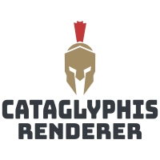

<h1 align="center">
  <br>
  <a href="https://jonasheinle.de"></a>
  <br>
  This CMake/C++ template project gives me a good starting point for f.e. GPU/Graphics programming. For everything close to hardware ... 
  <br>
</h1>

<!-- <h1 align="center">
  <br>
  <a href="https://jonasheinle.de"></a>
  <a href="https://jonasheinle.de"></a>
  <a href="https://jonasheinle.de"></a>
</h1> -->

<h4 align="center">A template <a href="https://jonasheinle.de" target="_blank"></a>.</h4>

<!-- [](https://github.com/Kataglyphis/GraphicsEngineVulkan/actions/workflows/Linux.yml)
[](https://github.com/Kataglyphis/GraphicsEngineVulkan/actions/workflows/Windows.yml)
[]() -->
[](https://www.paypal.com/paypalme/JonasHeinle)
[](https://twitter.com/Cataglyphis_)

<p align="center">
  <a href="#about-the-project">About The Project</a> •
  <a href="#getting-started">Getting Started</a> •
  <a href="#license">License</a> •
  <a href="#literature">Literature</a>
</p>

<!-- TABLE OF CONTENTS -->
<details open="open">
  <summary>Table of Contents</summary>
  <ol>
    <li>
      <a href="#about-the-project">About The Project</a>
      <ul>
        <li><a href="#key-features">Key Features</a></li>
      </ul>
      <ul>
        <li><a href="#dependencies">Dependencies</a></li>
      </ul>
      <ul>
        <li><a href="#useful-tools">Useful tools</a></li>
      </ul>
    </li>
    <li>
      <a href="#getting-started">Getting Started</a>
      <ul>
        <li><a href="#prerequisites">Prerequisites</a></li>
        <li><a href="#installation">Installation</a></li>
      </ul>
    </li>
    <li><a href="#tests">Tests</a></li>
    <li><a href="#roadmap">Roadmap</a></li>
    <li><a href="#contributing">Contributing</a></li>
    <li><a href="#license">License</a></li>
    <li><a href="#contact">Contact</a></li>
    <li><a href="#acknowledgements">Acknowledgements</a></li>
    <li><a href="#literature">Literature</a></li>
  </ol>
</details>

<!-- ABOUT THE PROJECT -->
## About The Project

<!-- <h1 align="center">
  <br>
  <a href="https://jonasheinle.de"></a>
  <a href="https://jonasheinle.de"></a>
  <a href="https://jonasheinle.de"></a>
</h1> -->

<!-- [![Kataglyphis Engine][product-screenshot1]](https://jonasheinle.de)
[![Kataglyphis Engine][product-screenshot2]](https://jonasheinle.de)
[![Kataglyphis Engine][product-screenshot3]](https://jonasheinle.de) -->

This project is dedicated to compiling a comprehensive collection of best practices for C++ development using CMake. It serves as a definitive guide for starting new C++ projects, providing insights into optimal project setup, modern CMake techniques, and efficient workflows. The repository includes examples, templates, and detailed instructions to help developers of all levels adopt industry standards and improve their project configuration and build processes.

### Key Features

<!-- ❌  -->
<!-- |          Feature                    |   Implement Status |
| ------------------------------------| :----------------: |
| Rasterizer                          |         ✔️         |
| Raytracing                          |         ✔️         |
| Path tracing                        |         ✔️         |
| PBR support (UE4,disney,... etc.)   |         ✔️         |
| .obj Model loading                  |         ✔️         |
| Mip Mapping                         |         ✔️         | -->

### Dependencies
This enumeration also includes submodules.
* [nlohmann_json](https://github.com/nlohmann/json)
* [SPDLOG](https://github.com/gabime/spdlog)
* [gtest](https://github.com/google/googletest)
* [gbenchmark](https://github.com/google/benchmark)
* [google fuzztest](https://github.com/google/fuzztest)

##### Optional
* [Rust](https://www.rust-lang.org/)
* [corrision-rs](https://github.com/corrosion-rs/corrosion)
* [cxx](https://cxx.rs/)

### Useful tools
* [doxygen](https://www.doxygen.nl/index.html)
* [cppcheck](https://cppcheck.sourceforge.io/)
* [cmake](https://cmake.org/)
* [gsl](https://github.com/Microsoft/GSL)
* [NSIS](https://nsis.sourceforge.io/Main_Page)
* [cppcheck](https://cppcheck.sourceforge.io/)
* [valgrind](https://valgrind.org/)
* [clangtidy](https://github.com/llvm/llvm-project)
* [ClangPowerTools](https://www.clangpowertools.com/)
* [Codecov](https://app.codecov.io/gh)
* [Ccache](https://ccache.dev/)
* []()

### VSCode Extensions
* [CMake format](https://github.com/cheshirekow/cmake_format)
* [CMake tools](https://marketplace.visualstudio.com/items?itemName=ms-vscode.cmake-tools)
* [CppTools](https://github.com/microsoft/vscode-cpptools)

<!-- GETTING STARTED -->
## Getting Started

### Prerequisites
Dependencies to libraries are stated above.<br />
C++23 or higher required.<br />
C17 or higher required.<br />
CMake 3.31.5 or higher required.<br />

### Installation

1. Clone the repo
   ```sh
   git clone --recurse-submodules git@github.com:Kataglyphis/Kataglyphis-CMakeTemplate.git
   ```
   > **_NOTE:_** In case you forgot the flag --recurse run the following command  
   ```sh
   git submodule update --init --recursive

   ```
   afterwards.
2. Then build your solution with [CMAKE] (https://cmake.org/) <br />
  Here the recommended way over command line after cloning the repo:<br />
  > **_NOTE:_** Here we use CmakePresets to simplify things. Consider using it too
  or just build on a common way.
  
  For now the features in Rust are experimental. If you want to use them install
  Rust and set `RUST_FEATURES=ON` on your CMake build.

  (for clarity: Assumption you are in the dir you have cloned the repo into)
  ```sh
  $ mkdir build ; cd build
  # enlisting all available presets
  $ cmake --list-presets=all ../
  $ cmake --preset <configurePreset-name> ../
  $ cmake --build --preset <buildPreset-name> .
  ```

### Upgrades
#### Rusty things:
1. Do not forget to upgrade the cxxbridge from time to time:
```bash
cargo install cxxbridge-cmd
```

# Tests
I have four tests suites.

1. Compilation Test Suite: This suite gets executed every compilation step. This ensures the very most important functionality is correct before every compilation.

2. Commit Test Suite: This gets executed on every push. More expensive tests are allowed :) 

3. Perf test suite: It is all about measurements of performance. We are C++ tho! 

4. Fuzz testing suite

## Static Analyzers

```bash
clang --analyze --output-format html $(find Src -name '*.cpp' -o -name '*.cc')
scan-build cmake --build .
clang-tidy -p=./build/compile_commands.json  $(find Src -name '*.cpp' -o -name '*.cc')

```

# Format cmake files

```bash
uv venv
source .venv/bin/activate
pip install -v -e .
cmake-format -c ./.cmake-format.yaml -i $(find cmake -name '*.cmake' -o -name 'CMakeLists.txt')
```
# Format code files 

```bash
clang-format -i $(find include -name "*.cpp" -or -name "*.h" -or -name "*.hpp")
```

# Docs
Build the docs
```bash
pip install -v -e .
cd docs 
make html
```

<!-- ROADMAP -->
## Roadmap
Upcoming :)
<!-- See the [open issues](https://github.com/othneildrew/Best-README-Template/issues) for a list of proposed features (and known issues). -->


<!-- CONTRIBUTING -->
## Contributing

Contributions are what make the open source community such an amazing place to be learn, inspire, and create. Any contributions you make are **greatly appreciated**.

1. Fork the Project
2. Create your Feature Branch (`git checkout -b feature/AmazingFeature`)
3. Commit your Changes (`git commit -m 'Add some AmazingFeature'`)
4. Push to the Branch (`git push origin feature/AmazingFeature`)
5. Open a Pull Request


<!-- LICENSE -->
## License

<!-- CONTACT -->
## Contact

Jonas Heinle - [@Cataglyphis_](https://twitter.com/Cataglyphis_) - jonasheinle@googlemail.com

[jonasheinle.de](https://jonasheinle.de/#/landingPage)
<!-- ACKNOWLEDGEMENTS -->
## Acknowledgements

<!-- Thanks for free 3D Models: 
* [Morgan McGuire, Computer Graphics Archive, July 2017 (https://casual-effects.com/data)](http://casual-effects.com/data/)
* [Viking room](https://sketchfab.com/3d-models/viking-room-a49f1b8e4f5c4ecf9e1fe7d81915ad38) -->

## Literature 

Some very helpful literature, tutorials, etc. 

Rust
* [rust-lang](https://www.rust-lang.org/)

CMake/C++
* [Cpp best practices](https://github.com/cpp-best-practices/cppbestpractices)
* [Integrate Rust into CMake projects](https://github.com/trondhe/rusty_cmake)
* [corrision-rs](https://github.com/corrosion-rs/corrosion)
* [cxx](https://cxx.rs/)
* [C++ Software Design by Klaus Iglberger](https://meetingcpp.com/2024/Speaker/items/Klaus_Iglberger.html)
